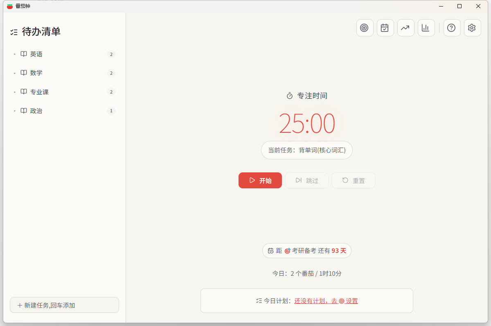
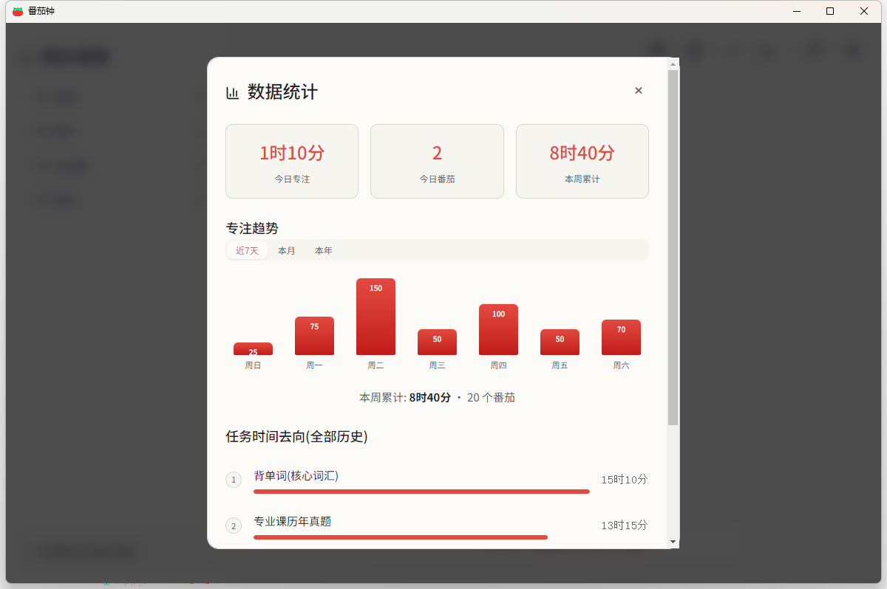
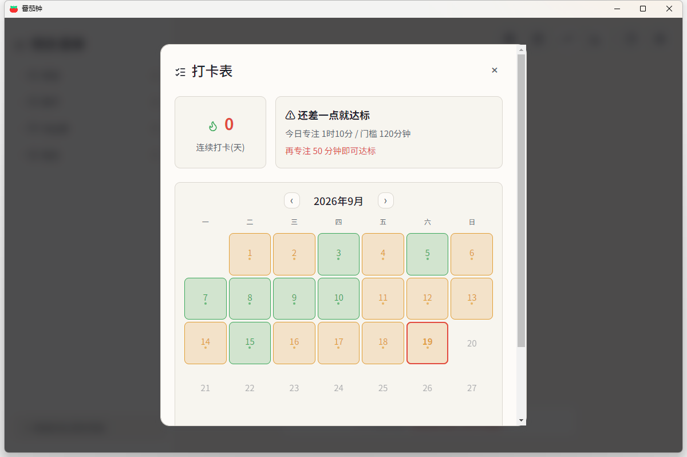
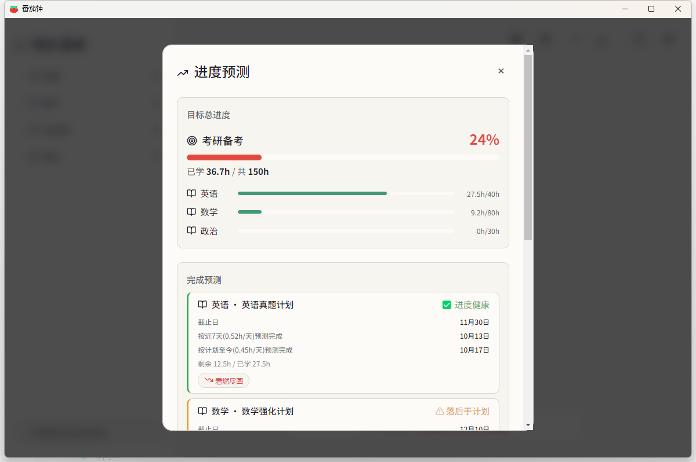
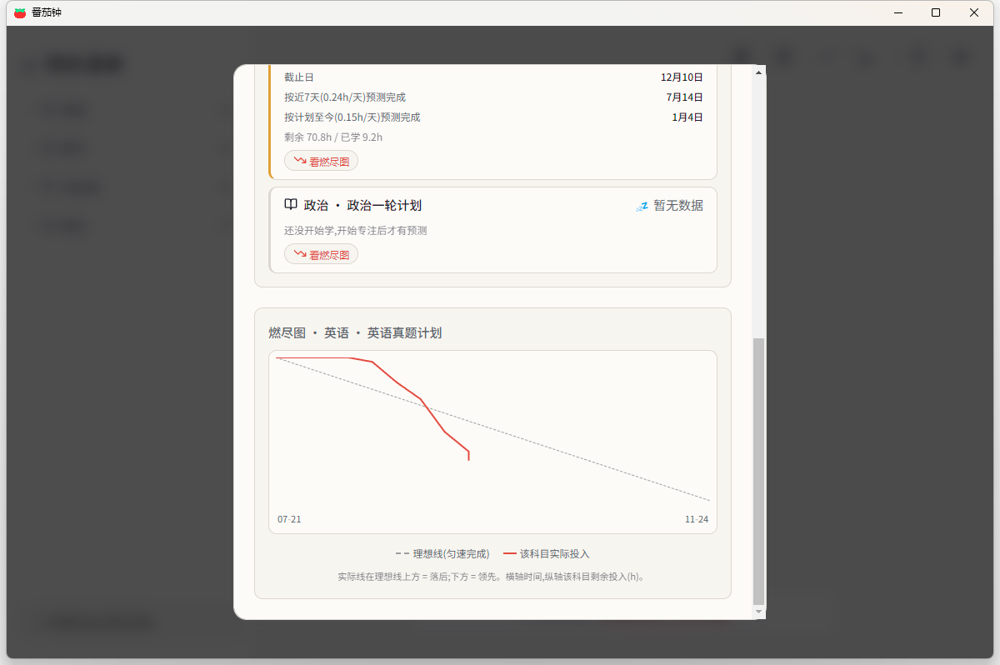
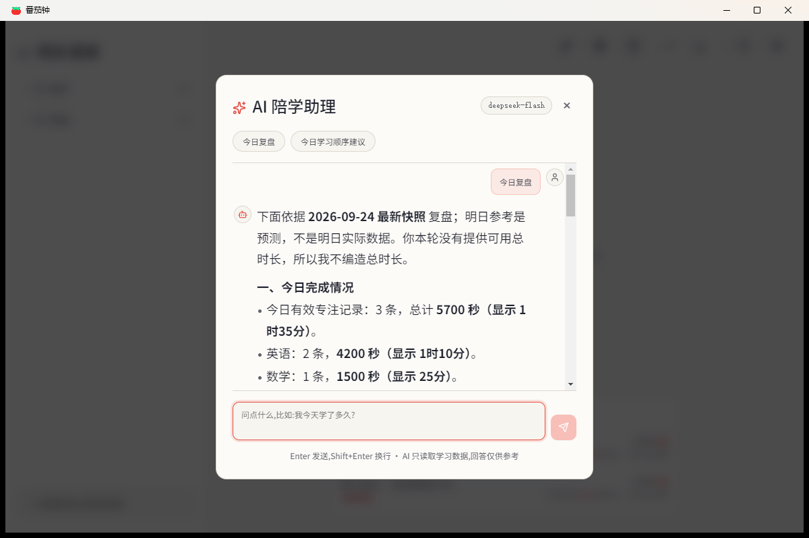

# 🍅 番茄钟

> 知道时间花哪去了。

桌面端番茄钟 + 目标管理工具。不只是倒计时,而是结合待办清单 + 目标计划 + 数据统计,帮你看清每天的时间去向。

## 📸 界面预览

*以下截图均为演示数据。*

<p align="center">
  
</p>

<table>
  <tr>
    <td width="50%"></td>
    <td width="50%"></td>
  </tr>
  <tr>
    <td align="center"><b>数据统计</b> · 时间花哪去了</td>
    <td align="center"><b>打卡表</b> · 日历热力图</td>
  </tr>
  <tr>
    <td></td>
    <td></td>
  </tr>
  <tr>
    <td align="center"><b>进度预测</b> · 双速率预测完成日</td>
    <td align="center"><b>燃尽图</b> · 实际 vs 理想投入</td>
  </tr>
</table>

## ✨ 功能

### ⏱️ 计时核心
- **可自定义时长**的工作/休息计时(不锁死 25 分钟,1-120 分钟随便设)
- **时间戳差值计时法**——系统休眠唤醒后时间依然准确
- **主进程接管结束检测**——窗口最小化/后台也能准点提醒
- **异常退出恢复**——闪退/断电后,下次启动自动按实际时长补记

### 📋 任务管理
- **任务绑定待办清单**——选任务 → 点开始 → 专注时长自动记到该任务名下
- **目标 → 科目 → 计划 → 任务** 四层结构,清晰管理学习/工作目标
- **任务选中持久化**——关掉重开,选中状态不丢
- **科目分组默认折叠**——任务多了不拥挤

### 📊 数据统计
- **今日概览** + 趋势折线图 + 任务时长排行
- **打卡表**(日历热力图 + 连续打卡天数 + 每日门槛)
- **进度预测**(目标总进度条 + 双速率完成预测 + SVG 燃尽图)
- **目标倒计时**(主界面常驻距 deadline 天数)

### 🤖 AI 陪学助理(可选)
- **接入 DeepSeek**:设置中填入自己的 API 密钥,选择模型(deepseek-flash / deepseek-v4-pro),即可对话
- **引导式建档**:和 AI 聊几句(考什么、几号截止、每天能学多久),它生成整套"目标+科目+计划"方案,过目后一键应用——不想聊也能继续手动管理
- **计划体检与智能调整**:AI 检查各计划健康度(基于真实速率与截止日),落后或危险时给出调整建议(改时长/改截止日),逐条"前 → 后"对照确认后应用;也可直接说"数学计划加 10 小时"
- **今日复盘**:AI 基于当日+近 7 天真实数据生成学习分析
- **今日学习顺序建议**:按当日计划与近期投入给出"先学什么、学多久"的建议(不绑定具体时刻)
- **安全设计**:AI 全程不直接改你的数据——写入必须经你确认;不填密钥则功能完全不出现,应用行为与之前完全一致
- 密钥只保存在本机数据文件中,绝不进代码仓库;使用 AI 时会把问题和学习摘要发送给 DeepSeek

<p align="center">
  
</p>

### 🎨 体验
- **深浅主题**跟随系统
- **lucide-react 专业图标库**
- **UI 随窗口自适应缩放**(小窗口不挤,大窗口不空)
- **小插件浮窗** + 全局快捷键(Ctrl+Shift+Space)
- **系统通知**(到点提醒)+ 托盘常驻 + 开机自启

## 🛠️ 技术栈

| 类别 | 技术 |
|------|------|
| 桌面框架 | Electron 31 |
| 前端 | React 18 + Vite 8 |
| 图标 | lucide-react |
| 测试 | Vitest(390 个) |
| 数据存储 | 本地 JSON(`%APPDATA%/pomodoro/data.json`) |

## 🚀 使用

### 直接使用(免安装版)
到 [Releases 页面](../../releases) 下载 zip 压缩包,解压后双击 `番茄钟.exe` 即可,无需安装、无需配置环境。

### 开发模式
```bash
npm install      # 装依赖(electron 二进制走 npmmirror 镜像)
npm run dev      # 启动 Vite + Electron 热重载
npm test         # 跑测试
```

## 📌 项目状态

当前版本 **v0.7.0**。目标计划系统 4 阶段(目标/计划/打卡/预测)与 AI 陪学助理三期(对话复盘/引导式建档/智能调计划)全部落地,进入使用反馈驱动的维护期。

完整版本历史见 [CHANGELOG.md](CHANGELOG.md)。

## 📝 说明

- **本地单机版**:数据存本机;计时/统计等核心功能完全离线可用,**仅 AI 助手需要在设置中主动配置密钥并联网调用 DeepSeek**(不配置则应用零联网)
- **个人自用**:非商业项目,功能按实际需求驱动
- **开源协议**:基于 [MIT License](LICENSE) 开源,可自由使用和修改
